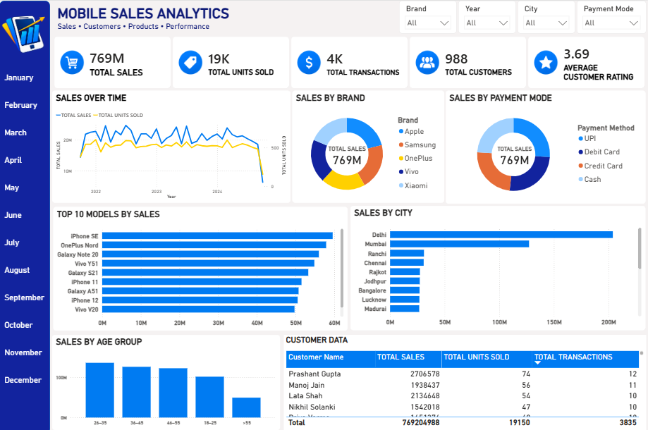

# Mobile Sales Analytics Dashboard

An interactive Power BI dashboard designed to analyze mobile sales, customers, products, and overall sales performance.

## Dashboard Overview

The dashboard provides an overview of:

- Total Sales
- Total Units Sold
- Total Transactions
- Total Customers
- Average Customer Rating
- Sales trends over time
- Sales by brand
- Sales by payment mode
- Top 10 models by sales
- Sales by city
- Sales by age group
- Customer-level sales data

## Interactive Filters

The dashboard includes filters for:

- Brand
- Year
- City
- Payment Mode

The dashboard also provides monthly navigation from January to December.

## Dashboard Highlights

- Total Sales: 769M
- Total Units Sold: 19K
- Total Transactions: 4K
- Total Customers: 988
- Average Customer Rating: 3.69

## Data & Analysis

- Created a custom calendar using Power Query
- Developed DAX measures for the majority of the dashboard KPIs
- Built interactive calculations and performance metrics
- Used data modeling and visualization to present sales insights

## Dataset

The dashboard was built using a mobile sales practice dataset provided in xlsx format.

The dataset contains information used to analyze sales, customers, products, payment methods, cities, and customer ratings.

## Dashboard Preview

## Tools Used

- Microsoft Power BI
- DAX
- Power Query

## Project Purpose

This is an individual portfolio project created to practice data transformation, data modeling, DAX calculations, data visualization, dashboard design, and business analysis.
